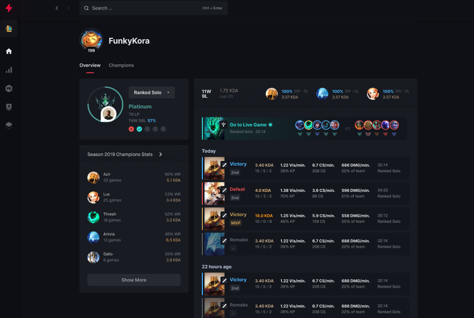

# Full-Stack Take-Home Challenge: League of Legends Match Stats Dashboard

## Overview:

Design and build a dynamic, visually appealing web application that provides a comprehensive overview of a League of Legends summoner's stats using the Riot Games API ([https://developer.riotgames.com/docs/portal](https://developer.riotgames.com/docs/portal)).

To provide some visual inspiration for the dashboard layout and components, you’ll find attached a screenshot of our application for the LoL player profile. Please note that this is just a suggestion, and feel free to be creative and come up with your own unique design.

Given a summoner name (you can find summoner names on [https://mobalytics.gg/lol/search/live-games/](https://mobalytics.gg/lol/search/live-games/) or any other tracker), the application should display:

* A Profile Summary Component
* **AND** one of the following options:
    * [OPTION A] A Match History Component
    * [OPTION B] An Aggregated Stats Component

## Components:

1. Profile Summary Component:

    * Information to display:
        * Summoner name
        * Level
        * Icon
        * Rank (if applicable)
        * *Mastery score (bonus points)

2. [OPTION A] Match History Component:

    * Match information to display:
      * Date and time played
      * Game mode (Ranked, Normal, etc.)
      * Champion played
      * Win/Loss outcome
      * Key stats: kills, deaths, assists, gold earned, vision score
    * Bonus points:
      * Sorting and filtering options: date, game mode, champion, win/loss
      * Pagination for managing long match histories
      * Optional: Hovering over a match shows detailed stats popup

3. [OPTION B] Aggregated Stats Component:

    * Key statistics to calculate and display:
        * KDA (Kill/Death/Assist ratio)
        * Win rate
        * Most played champions
        * Preferred roles
    * Visualization techniques:
        * Charts and graphs for clear and engaging data presentation
        * Consider bar charts for win rate, pie charts for champion distribution, and line graphs for trends over time
   * Bonus points:
        * Champion-specific stats comparison
        * Timeline visualization of match history

## Requirements:

**Use React for the frontend and the language of your choice for the backend.**

**If you have any questions, feel free to reach out to [mbeddiaf@blitz.gg](mailto:mbeddiaf@blitz.gg)**

* Backend:
    * Securely integrate with the Riot Games API to access summoner and match data.
        * Get a summoner by name [https://developer.riotgames.com/apis#summoner-v4/GET_getBySummonerName](https://developer.riotgames.com/apis#summoner-v4/GET_getBySummonerName)
        * Get a list of match IDs by PUUID [https://developer.riotgames.com/apis#match-v5/GET_getMatchIdsByPUUID](https://developer.riotgames.com/apis#match-v5/GET_getMatchIdsByPUUID)
        *  Get a match by ID [https://developer.riotgames.com/apis#match-v5/GET_getMatch](https://developer.riotgames.com/apis#match-v5/GET_getMatch)
    * Provide a well-defined API endpoint for the frontend to consume match and aggregated stats.
* Frontend:
    * Develop a responsive and user-friendly UI layout for each component.
    * Design the profile information to be visually appealing and informative.
    * Create a clear and organized list of recent matches
    * Present aggregated stats using attractive and easy-to-understand charts or graphs.
    * Ensure the application functions smoothly on various screen sizes and devices.

## Bonus points:

* Implement additional features like:
    * Champion-specific stats and comparisons
    * Match history timeline visualization
    * User authentication and saved preferences
    * Data caching to optimize API calls
* Add creative touches to the UI design and user experience.

## Example

